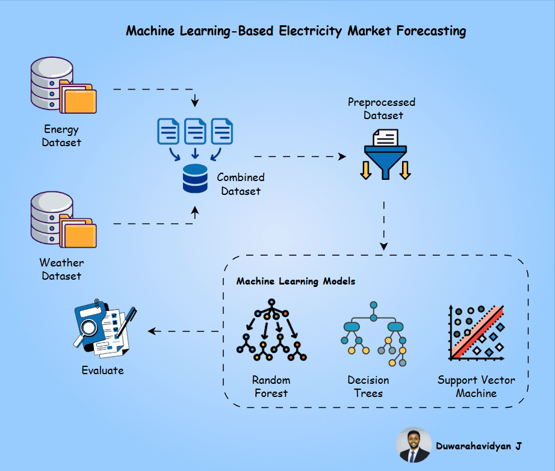
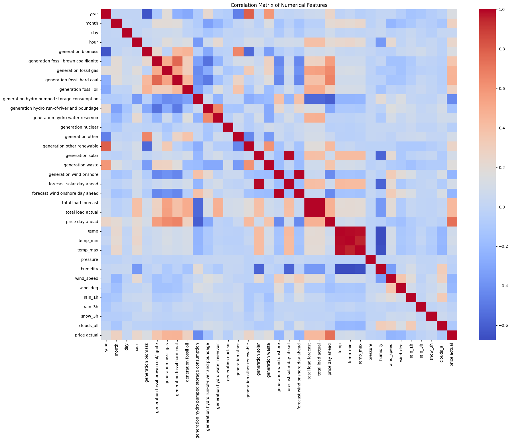
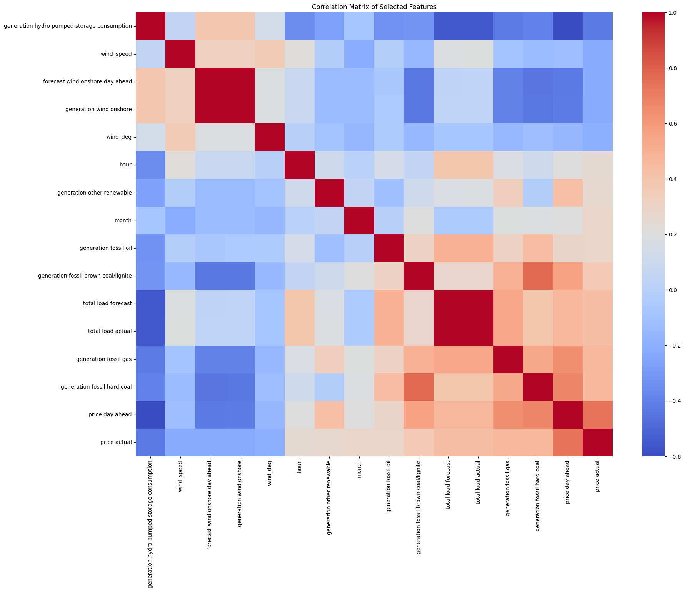

<!-- ============================================================ -->
<!-- 🌟 PROJECT HEADER -->
<!-- ============================================================ -->

<h1 align="center">
  &nbsp;
  
    
  ⚡ Machine Learning-Based Electricity Market Forecasting ⚡
</h1>

<h3 align="center">🔋 Forecasting Electricity Prices Using Support Vector Machines, Decision Trees, and Random Forest</h3>

  <em>An intelligent forecasting system leveraging Machine Learning to predict electricity market prices using energy and weather data.</em>

  
  
  
  
  

---

## ⚡ Introduction

The **electricity market** plays a vital role in maintaining the stability, sustainability, and efficiency of modern power systems ⚙️.  
With the ever-increasing demand for electricity 🔌, the diversification of generation sources ⚡, and the rapid adoption of renewable energy 🌞🌬️, market prices have become highly dynamic and unpredictable.

Frequent fluctuations in electricity prices pose challenges to:
- 🏭 **Market participants**, who must plan trading and bidding strategies effectively  
- 🧮 **Policy makers**, who design long-term energy management systems  
- 💡 **Consumers**, who seek to minimize cost and optimize energy usage  

---

### 🤖 Why Machine Learning?

Traditional time-series models such as **ARIMA**, **VAR**, and regression-based approaches often fail to capture the **non-linear dependencies** among energy generation, consumption, and weather parameters.  
In contrast, **Machine Learning (ML)** models excel at learning from historical data and capturing complex relationships, enabling **highly accurate, data-driven predictions** 📈.

---

### 🧩 Project Overview

This project integrates two major datasets: an **Energy Dataset** and a **Weather Dataset**, to construct a **comprehensive forecasting framework**.  

#### 🔹 Process Flow:
1. 🧼 **Data Preprocessing** – Cleaning, feature engineering, and normalization  
2. 🔗 **Dataset Integration** – Combining energy and weather attributes into a single dataset  
3. 🧠 **Model Training** – Building ML models including:
   - 🌳 **Decision Tree (DT)**
   - 🌲 **Random Forest (RF)**
   - 📈 **Support Vector Machine (SVM)**
4. 🧾 **Evaluation** – Assessing accuracy using **MAE**, **MSE**, and **R² Score**  

These models are trained to **forecast electricity prices 24 hours in advance**, providing insights into feature importance and market behavior.

---

### 🌍 Impact & Significance

The outcomes of this project are designed to:
- ⚡ Support **efficient energy management**
- 💰 Enable **optimal pricing strategies**
- 🧠 Improve **market transparency and stakeholder decision-making**
- 🌱 Foster **renewable integration** in sustainable power systems  

Ultimately, this research demonstrates how **Machine Learning transforms energy forecasting**, bridging data-driven intelligence with practical energy economics.

---

  

---

## 📚 Literature Survey

Electricity price forecasting has long been a focus area in energy analytics due to its impact on **market optimization**, **demand-side management**, and **renewable integration**.  
Traditional approaches such as **ARIMA**, **VAR**, and **linear regression** have been widely utilized, but their inability to model **non-linear and multi-factor dependencies** has paved the way for **Machine Learning (ML)**-based techniques 🚀.

---

### 🧠 Evolution of Forecasting Approaches

Recent studies emphasize the superiority of ML over classical statistical models in capturing complex market behavior:

- **Roussis [3]** applied **Deep Neural Networks (DNNs)** on the Spanish Electricity Market dataset (Kaggle), demonstrating enhanced accuracy compared to traditional models.  
- **Oliver [4]** explored multiple ML methods for short-term electricity price prediction and found that **weather-related features** significantly influence pricing outcomes.  
- **Liu et al. [5]** leveraged ML-based forecasting within a **multi-agent control framework**, optimizing real-time energy allocation decisions.  
- **Ansari et al. [6]** benchmarked **foundation models** like Chronos for time-series forecasting, highlighting the dataset’s value as a standard benchmark for ML research.

---

### ⚙️ Comparative Model Insights

Machine Learning methods — including **Support Vector Regression (SVR)**, **Decision Trees (DT)**, **Random Forests (RF)**, and **XGBoost** — have consistently outperformed traditional models in forecasting volatility and uncertainty:

- **Bilal et al. [7]** compared **SVR**, **MLP**, and **ARIMA**, showing that SVR achieves **superior performance** in modeling complex, non-linear price fluctuations.  
- Ensemble-based approaches improved **robustness and generalization**, confirming ML’s role as a **state-of-the-art solution** for electricity market prediction.  

Together, these studies establish **ML forecasting models** as the foundation for **next-generation energy market analytics**.

---

## 📂 Dataset Description

The foundation of this project is the **Hourly Energy Demand, Generation, Prices & Weather (Spain)** dataset 🇪🇸 — a rich, real-world dataset that provides **four years of hourly data** connecting **energy market variables** with **weather attributes** across Spain’s largest cities.

📊 **Dataset Source:**  
👉 [Hourly Energy Demand, Generation and Weather – Kaggle](https://www.kaggle.com/datasets/nicholasjhana/energy-consumption-generation-prices-and-weather/data)

---

### 🧾 Overview

This dataset brings together:

- ⚡ **Hourly market data** – including total energy demand, generation by fuel type, and actual market prices.  
- 🌦️ **Weather observations** – including temperature, humidity, wind speed, and cloud coverage for Spain’s **five major cities**:  
  **Madrid**, **Barcelona**, **Valencia**, **Seville**, and **Bilbao**.  

Together, these datasets offer a **comprehensive multi-dimensional view** of the factors influencing electricity prices, making it ideal for machine learning applications.

---

### 🧩 Datasets Used

| 📁 Dataset Name | 📘 Description | 🔑 Key Attributes |
|------------------|----------------|-------------------|
| **Energy Dataset (`energy_dataset.csv`)** | Contains Spain-wide hourly market data for electricity demand, generation, and prices. | `generation fossil gas`, `generation solar`, `generation wind`, `total load actual`, `price actual` |
| **Weather Dataset (`weather_features.csv`)** | Includes hourly meteorological data for the five largest Spanish cities. | `temperature`, `humidity`, `wind_speed`, `cloud_cover`, `city_name` |

---

### 🔍 Dataset Statistics

- **Duration:** 4 years (Hourly records)  
- **Total Features:** 44 input variables  
- **Target Variable:** `price_actual (EUR/MWh)`  
- **Forecast Horizon:** 24-hour ahead **(Day-Ahead Price Forecasting)**  

These datasets were combined, cleaned, and preprocessed to build a unified dataset that captures **energy–weather interdependencies**, enabling the ML models to learn **how climate, demand, and generation jointly drive electricity prices**.

---

### 🧠 Why This Dataset?

✅ **Comprehensive:** Integrates both energy market and weather aspects.  
✅ **Temporal Depth:** Four years of hourly data allows strong time-series modeling.  
✅ **Geographical Breadth:** Covers multiple regions with distinct climates and energy patterns.  
✅ **Benchmark Quality:** Used in multiple ML studies for energy price forecasting and demand analysis.  

This combination of **market complexity + meteorological diversity** makes it an ideal choice for training **machine learning models** like SVM and Decision Trees for robust electricity price forecasting 🔮.

---

## 🧹 Data Preprocessing & Feature Engineering

Real-world energy system data is often **noisy, incomplete, and inconsistent**, requiring several stages of **data cleaning and transformation**.  
In this project, the preprocessing pipeline was designed to ensure that the datasets were **accurate, reliable, and feature-rich** for electricity price forecasting.

---

### ⚙️ Key Preprocessing Steps

1. 🧼 **Data Cleaning:**  
   - Handled missing and null values using statistical imputation.  
   - Removed redundant and irrelevant columns.  

2. 🧩 **Feature Engineering:**  
   - Created **time-based attributes** (year, month, day, hour) to capture temporal patterns.  
   - Merged the **energy** and **weather** datasets on timestamp.  
   - Normalized and scaled numerical features for uniformity.  

3. 🔍 **Correlation Analysis:**  
   - Generated a **correlation matrix** to identify strong relationships with `price_actual`.  
   - Selected top features to reduce redundancy and enhance performance.  

---

### 📊 Correlation Analysis Before Feature Selection

  

---

### 🔎 Correlation Analysis After Feature Selection

  

**Selected Attributes:**

**🧠 Selected Attributes:**

- `generation hydro pumped storage consumption`  
- `wind_speed`  
- `forecast wind onshore day ahead`  
- `generation wind onshore`  
- `wind_deg`  
- `hour`  
- `generation other renewable`  
- `month`  
- `generation fossil oil`  
- `generation fossil brown coal/lignite`  
- `total load forecast`  
- `total load actual`  
- `generation fossil gas`  
- `generation fossil hard coal`  
- `price day ahead`

These selected features were determined based on their **strong correlation with the target variable** (`price_actual`) and their **relevance to market behavior and meteorological factors**. By focusing on these attributes, the resulting dataset becomes more **informative**, **less redundant**, and **optimized for high-performance ML modeling**.

---

### ⚖️ Outlier Treatment

Several features exhibited **extreme outliers**, which could distort model performance.  
To mitigate this, the **capping method** was applied — setting upper/lower thresholds and replacing values beyond them, preserving the core data distribution while reducing noise.

> 🧠 This ensured model robustness and prevented overfitting from anomalous data points.

---

### 🔗 Explore the Full Workflow

  

---

## 🏁 Conclusion

After completing the **data preprocessing and model training pipeline**, three machine learning models were evaluated to forecast **day-ahead electricity prices**.  
Performance was assessed using **MAE**, **MSE**, **RMSE**, and **R² Score**.

---

### 📊 Model Performance Comparison

| 🧠 Model | ⚙️ MAE ↓ | 📉 MSE ↓ | 📏 RMSE ↓ | 📈 R² ↑ |
|:------------------------------:|-----------:|------------:|------------:|------------:|
| 💻 Support Vector Machine (SVM) | 4.6405 | 61.0617 | 7.8142 | 0.6993 |
| 🌳 Decision Tree Regressor | 3.9997 | 52.9435 | 7.2762 | 0.7393 |
| 🪄 **Random Forest Regressor** | **2.9589** | **24.3357** | **4.9331** | **0.8802** |

---

### 🧩 Model Insights

- ⚡ **SVM** delivered stable results but struggled to capture deep non-linearities.  
- 🌲 **Decision Tree** improved interpretability but showed mild overfitting.  
- 🪄 **Random Forest** delivered **significant accuracy gains**, outperforming all models.

---

### 💡 Why Random Forest Excelled

Random Forest aggregates multiple decision trees, enabling it to:
- ✅ Capture **non-linear dependencies**
- ✅ **Reduce variance** and overfitting through bagging  
- ✅ Handle **noisy and high-dimensional data** efficiently  
- ✅ Perform robustly **without extensive tuning**

Its ensemble structure makes it ideal for modeling **complex and dynamic electricity market behaviors**.

---

### 🌟 Final Takeaway

**Electricity price formation is inherently non-linear** and influenced by numerous external factors.  
The **Random Forest Regressor** proved to be the **most reliable and interpretable** model, delivering **robust, high-accuracy day-ahead forecasts** that can empower market participants, operators, and policymakers.

---

## 📚 10. References

Below are the key research studies, academic papers, and datasets that inspired and supported the development of this project.  
These works collectively explore various **forecasting methods**, **machine learning techniques**, and **energy market analyses** relevant to electricity price prediction.

---

### 🔍 Core Research References

1. **A. J. Conejo, M. A. Plazas, R. Espínola, and A. B. Molina**  
   *Day-ahead electricity price forecasting using the wavelet transform and ARIMA models.*  
   *IEEE Transactions on Power Systems*, vol. 20, no. 2, pp. 1035–1042, 2005.  
   🔗 *Pioneering work combining ARIMA with signal processing for electricity price forecasting.*

2. **H. Liu and H. Tian**  
   *A hybrid framework for short-term electricity price forecasting using data preprocessing technique and deep learning.*  
   *Energy*, vol. 172, pp. 531–548, Apr. 2019.  
   ⚡ *Introduced a hybrid deep learning framework integrating preprocessing with neural architectures.*

3. **C. Roussis**  
   *Electricity Price Forecasting with Neural Networks Using the Spanish Electricity Market Dataset.*  
   *Energy Reports*, 2021.  
   🧠 *Applied deep neural networks to the Spanish market dataset, improving prediction accuracy.*

4. **J. Oliver**  
   *Machine Learning Approaches for Electricity Price Forecasting Using Energy Demand and Weather Data.*  
   *Master Thesis, University of Barcelona*, 2020.  
   🌤️ *Demonstrated the influence of weather features on short-term price dynamics.*

5. **Y. Liu, H. Sun, and J. Wang**  
   *A Multi-Agent Controller for Shared Energy Systems Based on Energy Price Forecasting.*  
   *Applied Energy*, vol. 341, 2023.  
   🤖 *Explored ML-driven multi-agent control systems integrating real-time price forecasts.*

6. **A. Ansari, S. E. Khademi, and H. Xu**  
   *Chronos: Learning the Language of Time Series.*  
   *arXiv preprint*, arXiv:2403.07815, 2024.  
   🧩 *Introduced Chronos, a foundation model for universal time-series forecasting.*

7. **M. Bilal, F. S. Almutairi, and T. Mahmood**  
   *Comparative Analysis of Time-Series Forecasting Approaches for Energy Consumption and Price.*  
   *arXiv preprint*, arXiv:2207.01019, 2022.  
   📈 *Benchmark comparison of ML and statistical forecasting models, including SVR and MLP.*

---

<h4 align="center">⚡ Smart • Predictive • Sustainable – Powering the Future of Energy with Machine Learning ⚡</h4>

  
  &nbsp;
  
  &nbsp;
  

